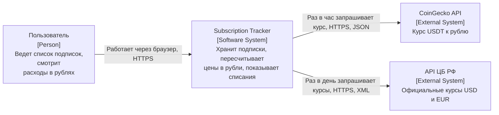
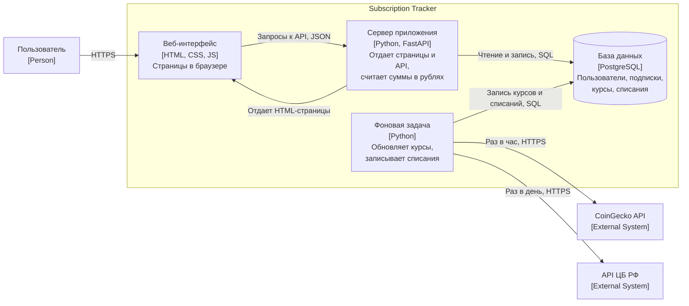
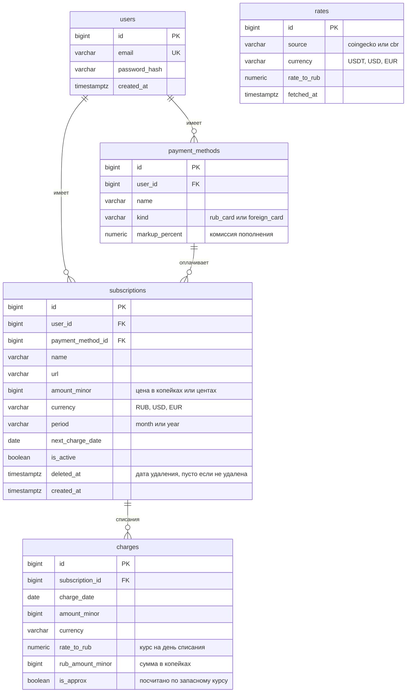
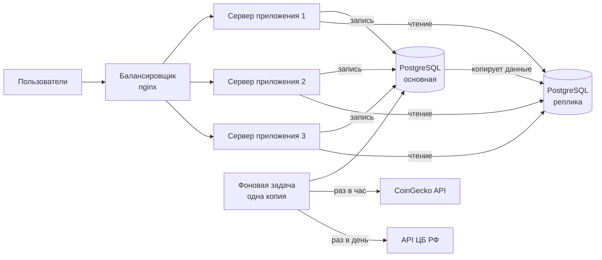

# Учет подписок с пересчетом по курсам

Курсовой проект по дисциплине "Конструирование программного обеспечения", СПбПУ.

## Команда

| Участник | Группа |
|---|---|
| Пономаренко Мирослав | 5130904/40108 |
| Прокопенко Никита | 5130904/40108 |
| Попов Артём | 5130904/40108 |
| Пыленков Елисей | 5130904/40108 |

## Этап 1. Проблема и тема

**Проблема.** У многих людей есть 5-10 регулярных подписок, часть из них в иностранной валюте и оплачивается через иностранные карты, их пополняют криптовалютой. Полный список подписок никто не помнит, а реальную сумму в рублях в месяц никто не знает, потому что курс USDT меняется каждый день и цена одной и той же подписки в рублях каждый месяц разная. В итоге деньги списываются неожиданно, а за забытые подписки платят месяцами.

**Тема.** Учет регулярных подписок с пересчетом стоимости по курсам ЦБ РФ и криптовалют. Пользователь добавляет подписки и указывает, чем платит (российская или иностранная карта). Сервис сам подтягивает курсы и показывает стоимость каждой подписки и общую сумму в рублях, ближайшие списания и историю расходов по месяцам.

## Этап 2. Выработка требований

### Кто наш пользователь

Человек, который платит за несколько сервисов каждый месяц. Часть подписок российские (связь, Яндекс Плюс, облако), часть зарубежные (ChatGPT, Spotify, VPN, игры). Зарубежные он оплачивает иностранной картой, которую пополняет через криптовалюту, поэтому за одну и ту же подписку каждый месяц списывается разная сумма в рублях.

### Пользовательские сценарии

**Сценарий 1. Собрать все подписки в одном месте**

Как пользователь, я хочу внести все свои подписки в один список, чтобы не забывать, за что я плачу.

Готово, когда:
- можно зарегистрироваться по почте с паролем и потом войти;
- при добавлении подписки указываются название, ссылка, цена, валюта (рубли, доллары или евро), как часто списывается (раз в месяц или раз в год), когда следующее списание и какой картой платится;
- российской картой можно платить только в рублях, иностранной только в долларах и евро;
- у иностранной карты можно один раз указать, сколько процентов берет сервис пополнения;
- подписку можно поменять, выключить на время или удалить;
- чужие подписки не видны.

**Сценарий 2. Узнать, сколько уходит в рублях**

Как пользователь, я хочу видеть, сколько каждая подписка и все вместе стоят мне в рублях за месяц и за год, чтобы понимать свои расходы.

Готово, когда:
- рядом с ценой в валюте написана цена в рублях;
- подписки в долларах пересчитываются по курсу USDT, к нему добавляется процент сервиса пополнения;
- подписки в евро сначала переводятся в доллары по курсу ЦБ, дальше так же через USDT;
- годовая подписка в сумме за месяц учитывается как двенадцатая часть цены;
- видно, по курсу на какую дату посчитано;
- если курс давно не обновлялся, об этом написано рядом с суммой.

**Сценарий 3. Подготовиться к списаниям**

Как пользователь, я хочу знать, что спишется в ближайшую неделю, чтобы заранее положить деньги на карту.

Готово, когда:
- показаны подписки, которые спишутся в ближайшие 7 дней, по порядку дат, и общая сумма;
- для иностранной карты отдельно написано, сколько долларов на ней должно быть;
- если подписка списывается 31 числа, а в месяце 30 дней, списание ставится на последний день месяца;
- после дня списания дата следующего платежа меняется сама.

**Сценарий 4. Посмотреть, сколько потрачено раньше**

Как пользователь, я хочу видеть, сколько я отдал за подписки в прошлые месяцы, чтобы замечать, когда расходы растут.

Готово, когда:
- в день списания сервис сам сохраняет, сколько это стоило в рублях по курсу того дня;
- можно посмотреть суммы по каждому месяцу за последний год;
- старые суммы не пересчитываются, когда курс меняется.

### Оценка нагрузки

Считаем, что в сутки сервис открывают 10 000 разных людей, а всего зарегистрировано около 30 000. Подписками не пользуются каждый час: обычно человек заходит проверить сумму или добавить новую подписку, в среднем 1-2 раза в день.

Сколько запросов приходится на одного человека в день и сколько всего:

| Что делает пользователь | Раз в день на человека | Запросов в сутки |
|---|---|---|
| Открывает главную страницу (список, сумма, ближайшие списания) | 3 | 30 000 |
| Смотрит историю расходов | 0,45 | 4 500 |
| Входит по паролю (вход запоминается на 30 дней) | 0,3 | 3 000 |
| Добавляет, меняет или удаляет подписку | 0,3 | 3 000 |
| Регистрируется (новые пользователи) | | 200 |
| Итого | | 40 700 |

В среднем это 40 700 / 86 400 = примерно 0,5 запроса в секунду.

Днем и ночью нагрузка разная. Считаем, что в самый загруженный вечерний час приходит 12 % всех запросов за день: 40 700 * 0,12 / 3 600 = примерно 1,4 запроса в секунду.

Почти все запросы только читают данные: из 40 700 запросов меняют что-то в базе только 3 200 (изменения подписок и регистрации), остальные 37 500 читают. Чтений примерно в 12 раз больше, чем записей.

Кроме запросов пользователей есть работа, которую сервер делает сам:
- курсы. USDT обновляется раз в час, курсы ЦБ раз в день, всего 25 обращений к внешним API в сутки. Это число не растет с количеством пользователей, потому что курс один на всех и лежит в нашей базе;
- списания. 30 000 пользователей по 7 подписок в среднем дают 210 000 подписок. Большинство из них месячные, поэтому каждый день наступает примерно 7 000 списаний, их сервер записывает ночью, когда пользователей мало.

Нагрузка небольшая, одного сервера и одной базы данных хватит с запасом. Точный расчет трафика и объема базы сделаем на этапе 3.

### Отказоустойчивость

Курсы валют сервис берет из двух внешних источников:
- CoinGecko: курс USDT к рублю, по нему считаются подписки на иностранной карте;
- ЦБ РФ: официальные курсы доллара и евро, нужны для подписок в евро и как запасной вариант.

Любой из этих сайтов может не ответить: упал, долго отвечает, временно ограничил нас за частые запросы или прислал непонятные данные. Ниже описано, как сервис продолжает работать в таких случаях.

**Курсы хранятся в нашей базе.** Сервер сам скачивает курсы по расписанию (USDT раз в час, ЦБ раз в день) и сохраняет их в базу вместе с датой. Когда пользователь открывает страницу, курс берется из базы, а во внешние API сервер не ходит. Поэтому пользователь не ждет ответа чужого сайта, и если сайт с курсами не отвечает, страницы открываются как обычно.

**Что видит пользователь при сбое:**

| Ситуация | Как считаются подписки в валюте | Что написано рядом с суммой |
|---|---|---|
| Оба источника работают | по свежему курсу USDT | дата и время курса |
| Не отвечает CoinGecko | по курсу доллара от ЦБ | "примерно, по курсу ЦБ" |
| Не отвечает ЦБ | подписки в долларах как обычно, в евро по последнему курсу ЦБ из базы | дата курса ЦБ |
| Не отвечают оба | по последним сохраненным курсам | "курс устарел" и дата курса |

**Что работает всегда.** Регистрация, вход, добавление и изменение подписок, подписки в рублях и список ближайших списаний от внешних сайтов не зависят и работают в любом случае.

**История списаний.** Если в день списания свежего курса нет, списание все равно записывается в историю по последнему сохраненному курсу и помечается как приблизительное. Так в истории не появляется пропусков.

**Повторные запросы.** Если сайт не ответил, сервер пробует еще 2 раза с паузой в несколько секунд. Если ответа так и нет, он ждет следующего обновления по расписанию и записывает ошибку в лог. Постоянно повторять запросы не нужно: курс обновляется редко, а частые запросы к упавшему сайту могут привести к блокировке.

## Этап 3. Архитектура и проектирование

### Архитектура (C4)

C4 это способ рисовать архитектуру по уровням, от общего к подробному. Нам 
нужны первые два уровня.

#### Диаграмма контекста (Context)

Самый общий взгляд: наша система, кто ей пользуется и с какими внешними 
сервисами она связана.

- **Пользователь** заходит на сайт, добавляет подписки и смотрит, сколько 
они стоят в рублях.

- **Subscription Tracker** - наша система.

- **CoinGecko** дает курс USDT. По нему считаются подписки, которые 
оплачиваются иностранной картой.

- **ЦБ РФ** дает официальные курсы доллара и евро. Нужен для подписок в евро 
и на случай, если CoinGecko не отвечает.

#### Диаграмма контейнеров (Container)

Здесь видно, из каких частей состоит наша система и как они общаются между 
собой.

- **Веб-интерфейс** - страницы, которые видит пользователь. Сервер собирает 
их по шаблонам и отдает в браузер. Потом JavaScript на странице сам 
обращается к API за данными, например когда пользователь добавляет подписку.

- **Сервер приложения** на FastAPI проверяет вход, сохраняет подписки и 
считает суммы в рублях. Курсы он берет только из базы и сам во внешние API 
не ходит. Поэтому пользователю никогда не приходится ждать, пока ответит 
чужой сайт.

- **Фоновая задача** работает по расписанию: раз в час получает курс USDT, 
раз в день курсы ЦБ и кладет их в базу. Ночью она записывает в историю все 
списания за день.

- **База данных** PostgreSQL хранит все данные сервиса.

### Схема базы данных

Все данные сервиса лежат в базе PostgreSQL. Таблиц пять, связи между ними показаны на схеме.

Что в какой таблице:
- `users` - пользователи. Пароль в открытом виде не хранится, только его хеш.
- `payment_methods` - карты пользователя. У иностранной карты тут же записан процент, который берет сервис пополнения.
- `subscriptions` - подписки. Цена записана целым числом в копейках или центах. С дробными числами при сложении бывают ошибки в копейках, с целыми таких ошибок нет.
- `rates` - курсы, которые сервер скачал из CoinGecko и ЦБ. Каждое обновление добавляет новую строку, старые остаются. Поэтому всегда можно узнать, какой был курс в любой день.
- `charges` - история списаний. Курс и сумма в рублях записываются в день списания и больше не меняются. Если курс потом изменится, история останется прежней.
- Валюта записана строкой до 4 символов, чтобы помещался и `USDT`, а не только `RUB`, `USD`, `EUR`.
- Удаленная подписка не стирается из базы: в поле `deleted_at` ставится дата удаления. Из списка у пользователя она пропадает, но история ее списаний остается.

Индексы. Индекс работает как оглавление в книге: по нему база сразу находит нужные строки и не перебирает всю таблицу.
| Индекс | Для чего нужен |
|---|---|
| `users(email)`, уникальный | найти пользователя при входе и не дать зарегистрировать одну почту дважды |
| `payment_methods(user_id)` | показать карты пользователя |
| `subscriptions(user_id)` | показать подписки пользователя на главной странице |
| `subscriptions(next_charge_date)`, только для активных подписок | ночью быстро найти подписки, которые списываются сегодня |
| `charges(subscription_id, charge_date)` | показать историю расходов по месяцам |
| `rates(source, currency, fetched_at)` | найти последний курс или курс на нужную дату |

Почему база справится. По этапу 2 в самый загруженный час приходит около 1,4 запроса в секунду. Каждый запрос находит данные по индексу и читает немного строк: у пользователя в среднем 7 подписок и около 84 списаний за год. Самая большая таблица `charges` за 5 лет дойдет примерно до 13 млн строк, но по индексу нужные строки в ней находятся за миллисекунды. Ночная задача тоже идет по индексу и берет только сегодняшние списания (около 7 000), а не все 210 000 подписок подряд.

### API

Раздел в работе: Елисей.

### Расчет нагрузки

Считаем от цифр этапа 2: 10 000 пользователей в сутки, 30 000 активных аккаунтов, 210 000 подписок, 40 700 запросов в сутки, около 1,4 запроса в секунду в самый загруженный час.

#### Чтение и запись

Одна страница может несколько раз обращаться к базе. Например, главная берет из базы подписки, курсы и ближайшие списания, это 3 чтения.

| Действие | Запросов в сутки | Чтений из базы на запрос | Чтений в сутки | Записей в сутки |
|---|---|---|---|---|
| Главная страница | 30 000 | 3 | 90 000 | |
| История расходов | 4 500 | 2 | 9 000 | |
| Вход | 3 000 | 1 | 3 000 | |
| Изменение подписки | 3 000 | | | 3 000 |
| Регистрация | 200 | | | 200 |
| Обновление курсов | 25 | | | 26 |
| Списания (ночью) | | | | 14 000 |
| Итого | | | 102 000 | 17 226 |

Ночные списания дают 14 000 записей: 7 000 новых строк в истории и еще 7 000 раз сдвигается дата следующего списания.

Если смотреть только на действия пользователей, чтений в 12 раз больше, чем записей. Если добавить ночную задачу, чтений больше примерно в 6 раз. Почти все записи делаются ночью, поэтому днем база в основном только читает.

#### Сетевой трафик

Сколько весит ответ сервера (без сжатия):

| Что отдаем | Размер | Сколько раз в сутки | Объем в сутки |
|---|---|---|---|
| Главная страница | 25 КБ | 30 000 | 750 МБ |
| История расходов | 15 КБ | 4 500 | 68 МБ |
| Страница и запрос входа | 5 КБ | 3 000 | 15 МБ |
| Изменение подписки | 3 КБ | 3 000 | 9 МБ |
| Регистрация | 5 КБ | 200 | 1 МБ |
| CSS, JS, иконки (раз в день, потом браузер берет их из своего кэша) | 100 КБ | 10 000 | 1 000 МБ |
| Итого | | | около 1,8 ГБ |

Входящий трафик маленький: запрос пользователя весит около 1 КБ, всего примерно 40 МБ в сутки.

В самый загруженный час: 1,8 ГБ * 0,12 / 3 600 = около 60 КБ в секунду, это примерно 0,5 Мбит/с. За месяц набегает около 55 ГБ.

Трафик к внешним API почти нулевой: ответ CoinGecko меньше 1 КБ, ответ ЦБ около 10 КБ, всего около 35 КБ в сутки. От числа пользователей он не зависит.

#### Место на диске за 5 лет

Каждый день регистрируется около 200 новых пользователей, примерно столько же перестает пользоваться сервисом. Поэтому активных аккаунтов остается около 30 000, и списания идут только по их подпискам. Но старые аккаунты и их подписки из базы не удаляются, и за 5 лет их накопится 30 000 + 200 * 365 * 5 = 395 000.

| Таблица | Строк через 5 лет | Размер строки с индексами | Объем |
|---|---|---|---|
| `users` | 395 000 | 200 Б | 79 МБ |
| `payment_methods` | 790 000 (по 2 карты) | 100 Б | 79 МБ |
| `subscriptions` | 2 765 000 (по 7 подписок) | 250 Б | 691 МБ |
| `rates` | 26 * 365 * 5 = 47 450 | 100 Б | 5 МБ |
| `charges` | 7 000 * 365 * 5 = 12 775 000 | 130 Б | 1 660 МБ |
| Итого | | | около 2,5 ГБ |

Больше всего места (около 2/3) занимает история списаний: она копится и не удаляется. На втором месте подписки старых аккаунтов.

Если активных пользователей станет вдвое больше, база вырастет примерно до 5 ГБ. Добавим служебные файлы PostgreSQL и резервные копии за последнюю неделю и возьмем диск на 20 ГБ, этого хватит с запасом.

### Масштабирование

Что будет, если пользователей станет в 10 раз больше, то есть 100 000 в сутки:

| Показатель | Сейчас | В 10 раз больше |
|---|---|---|
| Запросов в сутки | 40 700 | 407 000 |
| Запросов в секунду в загруженный час | 1,4 | 14 |
| Подписок у активных пользователей | 210 000 | 2 100 000 |
| Списаний в сутки | 7 000 | 70 000 |
| Трафик в сутки | 1,8 ГБ | 18 ГБ |
| Объем базы за 5 лет | 2,5 ГБ | 25 ГБ |
| Запросов к внешним API в сутки | 25 | 25 |

Что меняем:

1. **Несколько серверов вместо одного.** Запускаем 2-3 одинаковых сервера приложения. Перед ними ставим nginx, он раздает запросы между серверами по очереди. Сервер ничего не запоминает о пользователе между запросами: вход хранится в cookie, данные в базе. Поэтому серверы можно добавлять сколько нужно. Если один сломается, остальные продолжат работать.
2. **Фоновая задача отдельно и только одна.** Сейчас она работает внутри сервера. Если серверов станет три, курсы будут скачиваться три раза, а каждое списание запишется трижды. Поэтому выносим задачу в отдельную программу и запускаем ровно одну.
3. **Копия базы для чтения (реплика).** Читают из базы в 6 раз чаще, чем пишут. Делаем вторую базу, в которую основная постоянно копирует данные. Главная страница и история читают из копии, а все изменения идут в основную базу. Так основная база разгружается.
4. **Статику отдает nginx.** CSS, JS и иконки отдает nginx, а не наш сервер, и браузер сохраняет их у себя. Это самая большая часть трафика, и серверу приложения она больше не мешает.
5. **История по годам.** Таблица `charges` за 5 лет вырастет до 128 млн строк. В PostgreSQL ее можно разбить на части по годам. Тогда запрос истории за последний год смотрит только в свою часть, а старые годы ему не мешают.

#### Кэширование запросов к внешним API

Нас не заблокируют потому, что курс один для всех пользователей. Мы скачиваем его один раз и храним у себя.

- Фоновая задача берет курс USDT раз в час, а курсы ЦБ раз в день и сохраняет их в таблицу `rates`. Получается 25 запросов в сутки, и неважно, сколько у нас пользователей: 10 000 или 100 000.
- Сервер приложения во время запроса пользователя во внешние API не ходит. Курс он берет из базы.
- Чтобы не ходить за курсом в базу на каждый запрос, каждый сервер держит последний курс у себя в памяти и обновляет его раз в 5 минут.

Без кэша сервер спрашивал бы курс при каждом открытии страницы, а это около 345 000 запросов в сутки вместо 25. При таком потоке внешний API заблокировал бы нас в первые же минуты.
