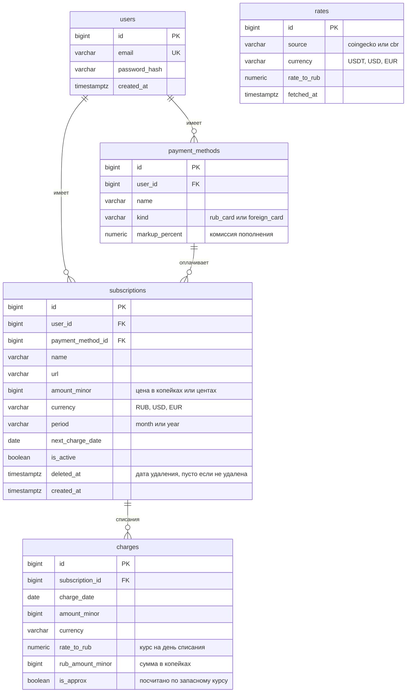

# Учет подписок с пересчетом по курсам

Курсовой проект по дисциплине "Конструирование программного обеспечения", СПбПУ.

## Команда

| Участник | Группа |
|---|---|
| Пономаренко Мирослав | 5130904/40108 |
| Прокопенко Никита | 5130904/40108 |
| Попов Артём | 5130904/40108 |
| Пыленков Елисей | 5130904/40108 |

## Этап 1. Проблема и тема

**Проблема.** У многих людей есть 5-10 регулярных подписок, часть из них в иностранной валюте и оплачивается через иностранные карты, их пополняют криптовалютой. Полный список подписок никто не помнит, а реальную сумму в рублях в месяц никто не знает, потому что курс USDT меняется каждый день и цена одной и той же подписки в рублях каждый месяц разная. В итоге деньги списываются неожиданно, а за забытые подписки платят месяцами.

**Тема.** Учет регулярных подписок с пересчетом стоимости по курсам ЦБ РФ и криптовалют. Пользователь добавляет подписки и указывает, чем платит (российская или иностранная карта). Сервис сам подтягивает курсы и показывает стоимость каждой подписки и общую сумму в рублях, ближайшие списания и историю расходов по месяцам.

## Этап 2. Выработка требований

### Кто наш пользователь

Человек, который платит за несколько сервисов каждый месяц. Часть подписок российские (связь, Яндекс Плюс, облако), часть зарубежные (ChatGPT, Spotify, VPN, игры). Зарубежные он оплачивает иностранной картой, которую пополняет через криптовалюту, поэтому за одну и ту же подписку каждый месяц списывается разная сумма в рублях.

### Пользовательские сценарии

**Сценарий 1. Собрать все подписки в одном месте**

Как пользователь, я хочу внести все свои подписки в один список, чтобы не забывать, за что я плачу.

Готово, когда:
- можно зарегистрироваться по почте с паролем и потом войти;
- при добавлении подписки указываются название, ссылка, цена, валюта (рубли, доллары или евро), как часто списывается (раз в месяц или раз в год), когда следующее списание и какой картой платится;
- российской картой можно платить только в рублях, иностранной только в долларах и евро;
- у иностранной карты можно один раз указать, сколько процентов берет сервис пополнения;
- подписку можно поменять, выключить на время или удалить;
- чужие подписки не видны.

**Сценарий 2. Узнать, сколько уходит в рублях**

Как пользователь, я хочу видеть, сколько каждая подписка и все вместе стоят мне в рублях за месяц и за год, чтобы понимать свои расходы.

Готово, когда:
- рядом с ценой в валюте написана цена в рублях;
- подписки в долларах пересчитываются по курсу USDT, к нему добавляется процент сервиса пополнения;
- подписки в евро сначала переводятся в доллары по курсу ЦБ, дальше так же через USDT;
- годовая подписка в сумме за месяц учитывается как двенадцатая часть цены;
- видно, по курсу на какую дату посчитано;
- если курс давно не обновлялся, об этом написано рядом с суммой.

**Сценарий 3. Подготовиться к списаниям**

Как пользователь, я хочу знать, что спишется в ближайшую неделю, чтобы заранее положить деньги на карту.

Готово, когда:
- показаны подписки, которые спишутся в ближайшие 7 дней, по порядку дат, и общая сумма;
- для иностранной карты отдельно написано, сколько долларов на ней должно быть;
- если подписка списывается 31 числа, а в месяце 30 дней, списание ставится на последний день месяца;
- после дня списания дата следующего платежа меняется сама.

**Сценарий 4. Посмотреть, сколько потрачено раньше**

Как пользователь, я хочу видеть, сколько я отдал за подписки в прошлые месяцы, чтобы замечать, когда расходы растут.

Готово, когда:
- в день списания сервис сам сохраняет, сколько это стоило в рублях по курсу того дня;
- можно посмотреть суммы по каждому месяцу за последний год;
- старые суммы не пересчитываются, когда курс меняется.

### Оценка нагрузки

Считаем, что в сутки сервис открывают 10 000 разных людей, а всего зарегистрировано около 30 000. Подписками не пользуются каждый час: обычно человек заходит проверить сумму или добавить новую подписку, в среднем 1-2 раза в день.

Сколько запросов приходится на одного человека в день и сколько всего:

| Что делает пользователь | Раз в день на человека | Запросов в сутки |
|---|---|---|
| Открывает главную страницу (список, сумма, ближайшие списания) | 3 | 30 000 |
| Смотрит историю расходов | 0,45 | 4 500 |
| Входит по паролю (вход запоминается на 30 дней) | 0,3 | 3 000 |
| Добавляет, меняет или удаляет подписку | 0,3 | 3 000 |
| Регистрируется (новые пользователи) | | 200 |
| Итого | | 40 700 |

В среднем это 40 700 / 86 400 = примерно 0,5 запроса в секунду.

Днем и ночью нагрузка разная. Считаем, что в самый загруженный вечерний час приходит 12 % всех запросов за день: 40 700 * 0,12 / 3 600 = примерно 1,4 запроса в секунду.

Почти все запросы только читают данные: из 40 700 запросов меняют что-то в базе только 3 200 (изменения подписок и регистрации), остальные 37 500 читают. Чтений примерно в 12 раз больше, чем записей.

Кроме запросов пользователей есть работа, которую сервер делает сам:
- курсы. USDT обновляется раз в час, курсы ЦБ раз в день, всего 25 обращений к внешним API в сутки. Это число не растет с количеством пользователей, потому что курс один на всех и лежит в нашей базе;
- списания. 30 000 пользователей по 7 подписок в среднем дают 210 000 подписок. Большинство из них месячные, поэтому каждый день наступает примерно 7 000 списаний, их сервер записывает ночью, когда пользователей мало.

Нагрузка небольшая, одного сервера и одной базы данных хватит с запасом. Точный расчет трафика и объема базы сделаем на этапе 3.

### Отказоустойчивость

Курсы валют сервис берет из двух внешних источников:
- CoinGecko: курс USDT к рублю, по нему считаются подписки на иностранной карте;
- ЦБ РФ: официальные курсы доллара и евро, нужны для подписок в евро и как запасной вариант.

Любой из этих сайтов может не ответить: упал, долго отвечает, временно ограничил нас за частые запросы или прислал непонятные данные. Ниже описано, как сервис продолжает работать в таких случаях.

**Курсы хранятся в нашей базе.** Сервер сам скачивает курсы по расписанию (USDT раз в час, ЦБ раз в день) и сохраняет их в базу вместе с датой. Когда пользователь открывает страницу, курс берется из базы, а во внешние API сервер не ходит. Поэтому пользователь не ждет ответа чужого сайта, и если сайт с курсами не отвечает, страницы открываются как обычно.

**Что видит пользователь при сбое:**

| Ситуация | Как считаются подписки в валюте | Что написано рядом с суммой |
|---|---|---|
| Оба источника работают | по свежему курсу USDT | дата и время курса |
| Не отвечает CoinGecko | по курсу доллара от ЦБ | "примерно, по курсу ЦБ" |
| Не отвечает ЦБ | подписки в долларах как обычно, в евро по последнему курсу ЦБ из базы | дата курса ЦБ |
| Не отвечают оба | по последним сохраненным курсам | "курс устарел" и дата курса |

**Что работает всегда.** Регистрация, вход, добавление и изменение подписок, подписки в рублях и список ближайших списаний от внешних сайтов не зависят и работают в любом случае.

**История списаний.** Если в день списания свежего курса нет, списание все равно записывается в историю по последнему сохраненному курсу и помечается как приблизительное. Так в истории не появляется пропусков.

**Повторные запросы.** Если сайт не ответил, сервер пробует еще 2 раза с паузой в несколько секунд. Если ответа так и нет, он ждет следующего обновления по расписанию и записывает ошибку в лог. Постоянно повторять запросы не нужно: курс обновляется редко, а частые запросы к упавшему сайту могут привести к блокировке.


## Этап 3. Архитектура и проектирование

### Архитектура (C4)

Раздел в работе: Артём.

### Схема базы данных

Все данные сервиса лежат в базе PostgreSQL. Таблиц пять, связи между ними показаны на схеме.



Что в какой таблице:
- `users` - пользователи. Пароль в открытом виде не хранится, только его хеш.
- `payment_methods` - карты пользователя. У иностранной карты тут же записан процент, который берет сервис пополнения.
- `subscriptions` - подписки. Цена записана целым числом в копейках или центах. С дробными числами при сложении бывают ошибки в копейках, с целыми таких ошибок нет.
- `rates` - курсы, которые сервер скачал из CoinGecko и ЦБ. Каждое обновление добавляет новую строку, старые остаются. Поэтому всегда можно узнать, какой был курс в любой день.
- `charges` - история списаний. Курс и сумма в рублях записываются в день списания и больше не меняются. Если курс потом изменится, история останется прежней.
- Валюта записана строкой до 4 символов, чтобы помещался и `USDT`, а не только `RUB`, `USD`, `EUR`.
- Удаленная подписка не стирается из базы: в поле `deleted_at` ставится дата удаления. Из списка у пользователя она пропадает, но история ее списаний остается.

Индексы. Индекс работает как оглавление в книге: по нему база сразу находит нужные строки и не перебирает всю таблицу.
| Индекс | Для чего нужен |
|---|---|
| `users(email)`, уникальный | найти пользователя при входе и не дать зарегистрировать одну почту дважды |
| `payment_methods(user_id)` | показать карты пользователя |
| `subscriptions(user_id)` | показать подписки пользователя на главной странице |
| `subscriptions(next_charge_date)`, только для активных подписок | ночью быстро найти подписки, которые списываются сегодня |
| `charges(subscription_id, charge_date)` | показать историю расходов по месяцам |
| `rates(source, currency, fetched_at)` | найти последний курс или курс на нужную дату |

Почему база справится. По этапу 2 в самый загруженный час приходит около 1,4 запроса в секунду. Каждый запрос находит данные по индексу и читает немного строк: у пользователя в среднем 7 подписок и около 84 списаний за год. Самая большая таблица `charges` за 5 лет дойдет примерно до 13 млн строк, но по индексу нужные строки в ней находятся за миллисекунды. Ночная задача тоже идет по индексу и берет только сегодняшние списания (около 7 000), а не все 210 000 подписок подряд.

### API

API это список адресов, по которым страница обращается к серверу. Сервер отвечает в формате JSON.

Почти все адреса работают только после входа: сервер узнает пользователя по cookie. Если пользователь не вошел, сервер отвечает кодом `401`. Без входа доступны только регистрация и сам вход.

Что значат коды ответа:
- `200` - все хорошо, `201` - запись создана, `204` - все хорошо, но отвечать нечем (например, после удаления);
- `401` - пользователь не вошел, `404` - такого нет, `409` - конфликт (например, почта уже занята), `422` - неправильные данные.

Время ответа - за сколько сервер должен ответить в обычной ситуации. Сервер успевает, потому что во время запроса не ходит во внешние API, а берет все из своей базы.

#### Регистрация и вход

| Метод и адрес | Что делает | Ответ | Ошибки | Время ответа |
|---|---|---|---|---|
| `POST /api/auth/register` | регистрация, нужны `email` и `password` | `201` и данные пользователя | `409` почта занята, `422` неправильные данные | до 500 мс |
| `POST /api/auth/login` | вход, сервер ставит cookie | `200` | `401` неверная почта или пароль | до 500 мс |
| `POST /api/auth/logout` | выход | `204` | | до 100 мс |

Регистрация и вход отвечают медленнее остальных. Пароль проверяется через специально медленную функцию (bcrypt), чтобы его было трудно подобрать перебором.

#### Карты

| Метод и адрес | Что делает | Ответ | Ошибки | Время ответа |
|---|---|---|---|---|
| `GET /api/payment-methods` | список карт пользователя | `200` и список | | до 200 мс |
| `POST /api/payment-methods` | добавить карту: `name`, `kind`, `markup_percent` | `201` и карта | `422` | до 300 мс |
| `PATCH /api/payment-methods/{id}` | изменить карту, например процент комиссии | `200` и карта | `404`, `422` | до 300 мс |

#### Подписки

| Метод и адрес | Что делает | Ответ | Ошибки | Время ответа |
|---|---|---|---|---|
| `GET /api/subscriptions` | все подписки с ценой в рублях | `200` и список | | до 200 мс |
| `POST /api/subscriptions` | добавить подписку | `201` и подписка | `422` | до 300 мс |
| `PATCH /api/subscriptions/{id}` | изменить подписку или поставить на паузу (`is_active`) | `200` и подписка | `404`, `422` | до 300 мс |
| `DELETE /api/subscriptions/{id}` | удалить подписку | `204` | `404` | до 300 мс |

Если пользователь пробует открыть чужую подписку, сервер отвечает `404`, а не "доступ запрещен". Так нельзя даже узнать, что подписка с таким номером вообще есть.

#### Расходы и курсы

| Метод и адрес | Что делает | Ответ | Время ответа |
|---|---|---|---|
| `GET /api/summary` | сумма за месяц и за год в рублях, дата курса, пометки "примерно" и "курс устарел" | `200` | до 200 мс |
| `GET /api/charges/upcoming?days=7` | списания на ближайшие дни, сумма в рублях и сколько долларов нужно на иностранной карте | `200` | до 200 мс |
| `GET /api/charges/history?months=12` | сколько потрачено по месяцам за последний год | `200` | до 500 мс |
| `GET /api/rates` | текущие курсы и когда они обновились | `200` | до 100 мс |

#### Пример: добавление подписки

Запрос `POST /api/subscriptions`:

```json
{
  "name": "ChatGPT Plus",
  "url": "https://chatgpt.com",
  "amount": 20.00,
  "currency": "USD",
  "period": "month",
  "next_charge_date": "2026-10-15",
  "payment_method_id": 2
}
```

Ответ `201`:

```json
{
  "id": 17,
  "name": "ChatGPT Plus",
  "amount": 20.00,
  "currency": "USD",
  "period": "month",
  "next_charge_date": "2026-10-15",
  "is_active": true,
  "price_rub": 1683.60,
  "rate_date": "2026-10-05T12:00:00+03:00",
  "rate_is_approx": false
}
```

Ответ с ошибкой `422`:

```json
{
  "error": "validation_error",
  "message": "Российской картой можно оплатить только подписку в рублях"
}
```

### Расчет нагрузки

Раздел в работе: Мирослав, расчет.

### Масштабирование

Раздел в работе: Мирослав, масштабирование.
